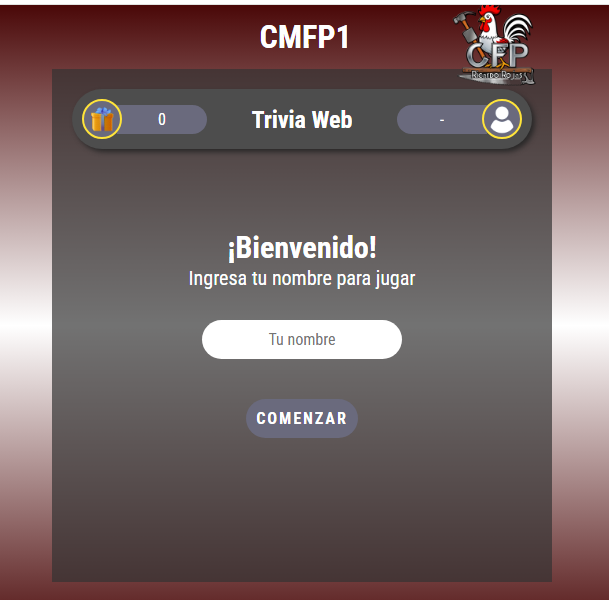
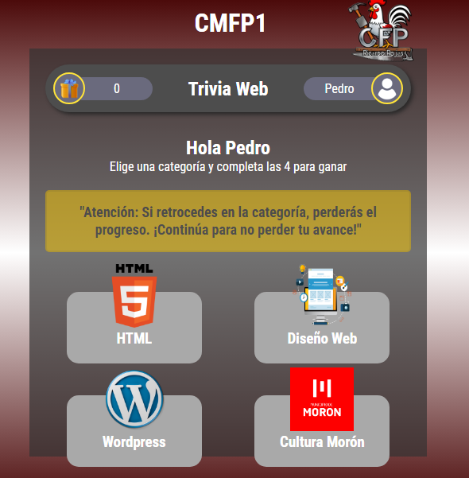
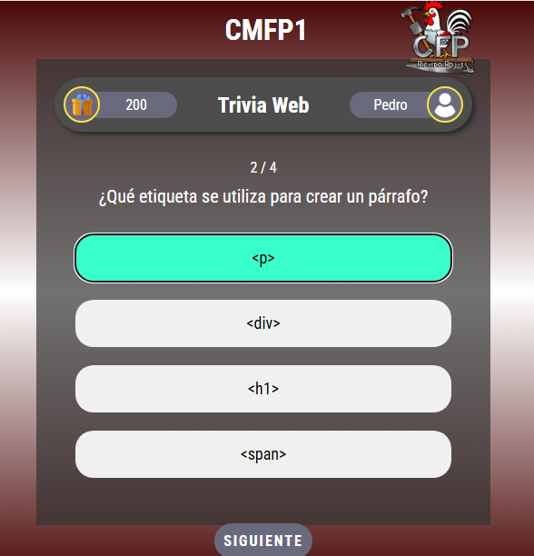
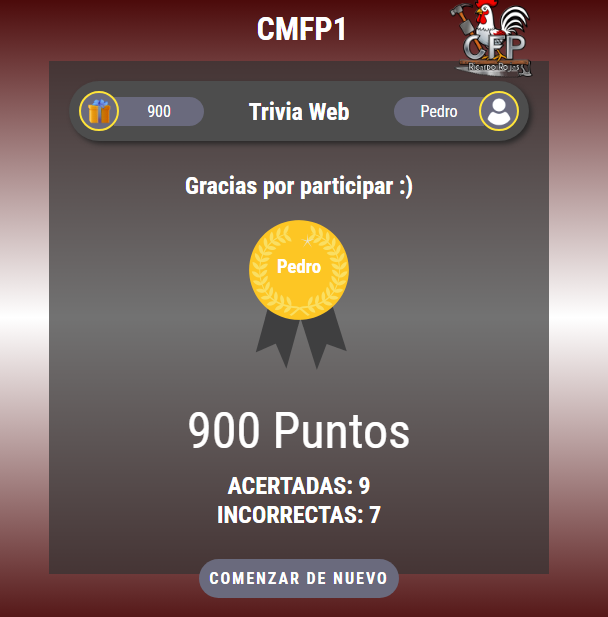

# 🎯 Trivia Web CMFP

Juego de trivia interactivo personalizado para el cierre de cursada del Centro Municipal de Formación Profesional "Ricardo Rojas" (CMFP 1) de Morón.

## 📝 Descripción

Este proyecto es una adaptación de una trivia genérica encontrada en GitHub (autor original no recordado). Fue modificado para crear un juego educativo con preguntas sobre:
- HTML
- Diseño Web
- WordPress
- Cultura e Historia de Morón

Se utilizó en el evento de cierre de cursada donde los participantes competían respondiendo preguntas para ganar premios.

## 🎮 Características

- **4 categorías temáticas** con 4 preguntas cada una
- **Sistema de puntuación** (100 puntos por respuesta correcta)
- **Validación de respuestas** antes de avanzar
- **Progreso guardado** usando LocalStorage
- **Pantalla de victoria** con música y animación
- **Diseño responsive** adaptable a móviles
- **Interfaz intuitiva** con feedback visual

## 🚀 Instalación y Uso

### Requisitos
- Navegador web moderno (Chrome, Firefox, Safari, Edge)
- Servidor local (opcional, pero recomendado)

### Opción 1: Servidor local
```bash
# Usando Python 3
python -m http.server 8000

# Usando Node.js (http-server)
npx http-server

# Usando PHP
php -S localhost:8000
```

Luego abre: `http://localhost:8000`

### Opción 2: Abrir directamente
Simplemente abre el archivo `index.html` en tu navegador.

**Nota:** Algunos navegadores pueden bloquear LocalStorage al abrir archivos localmente. Se recomienda usar un servidor local.

## 📸 Capturas de Pantalla

### index


### Categorias


### Preguntas


### Final


## 📁 Estructura del Proyecto

```
trivia-rojas/
│
├── index.html          # Pantalla de inicio
├── menu.html           # Menú de categorías
├── juego.html          # Pantalla de preguntas
├── final.html          # Pantalla de resultados
│
├── css/
│   └── estilo.css      # Estilos del juego
│
├── js/
│   ├── index.js        # Lógica de pantalla inicial
│   ├── menu.js         # Lógica del menú
│   ├── juego.js        # Lógica del juego (preguntas y respuestas)
│   └── final.js        # Lógica de pantalla final
│
├── img/
│   ├── LEEME.md        # Instrucciones para imágenes
│   └── (imágenes del juego)
│
└── audio/
    ├── LEEME.md        # Instrucciones para audio
    └── musica-victoria.mp3
```

## 🎨 Personalización

### Modificar preguntas
Edita el archivo `js/juego.js` y modifica el array `preguntas`:

```javascript
const preguntas = [
    {
        id: 1,
        categoria: "HTML",
        titulo: "¿Tu pregunta aquí?",
        opcionA: "Opción A",
        opcionB: "Opción B",
        opcionC: "Opción C",
        opcionD: "Opción D",
        correcta: "a" // a, b, c, o d
    },
    // ... más preguntas
];
```

### Cambiar categorías
1. Modifica el HTML en `menu.html`
2. Actualiza los nombres en el array de preguntas
3. Reemplaza las imágenes en `/img/`

### Personalizar colores
Edita `css/estilo.css` y modifica los valores hexadecimales de color.

## 🛠️ Tecnologías Utilizadas

- **HTML5** - Estructura
- **CSS3** - Estilos y animaciones
- **JavaScript (Vanilla)** - Lógica del juego
- **LocalStorage** - Persistencia de datos

## 📚 Aprendizajes

Este proyecto me permitió:
- Adaptar código de terceros a necesidades específicas
- Trabajar con LocalStorage para mantener estado
- Implementar lógica de juegos interactivos
- Validar entrada de usuarios
- Crear experiencias de usuario completas
- Gestionar múltiples pantallas en una aplicación web

## 🔧 Mejoras Implementadas

Sobre la versión original:
- ✅ Personalización completa de preguntas y categorías
- ✅ Validación de respuestas antes de avanzar
- ✅ Mensajes de error informativos
- ✅ Sistema de advertencias para el usuario
- ✅ Pantalla de felicitaciones animada
- ✅ Integración de música de victoria


## 📋 Tareas Pendientes

- [ ] Agregar más categorías
- [ ] Implementar tabla de clasificación
- [ ] Añadir temporizador por pregunta
- [ ] Modo multijugador
- [ ] Exportar resultados

## 🙏 Créditos

- **Código base:** Trivia genérica de GitHub (autor desconocido)
- **Adaptación y personalización:** Inti Fernandez
- **Institución:** CMFP 1 "Ricardo Rojas" - Municipio de Morón
- **Uso:** Evento de cierre de cursada 2024

## 📄 Licencia

Este proyecto es una adaptación educativa. Si encuentras al autor original del código base, por favor notifícamelo para darle el crédito apropiado.

---

**Nota**: Este proyecto fue desarrollado con fines educativos y para uso en eventos institucionales del CMFP 1.
